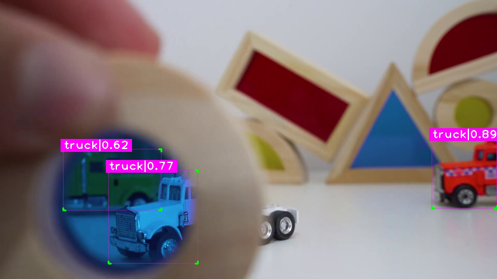
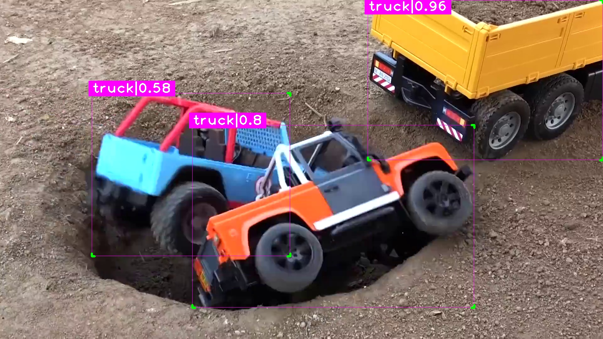
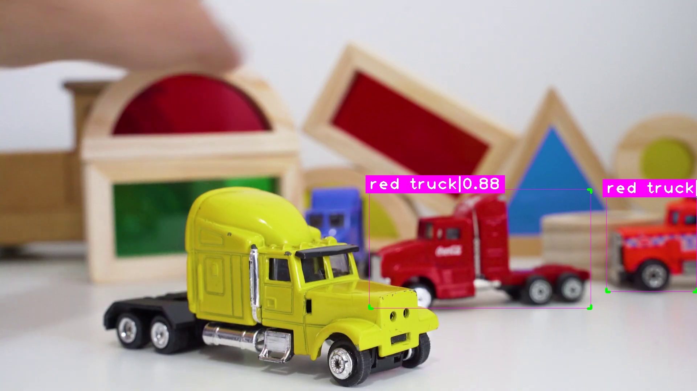
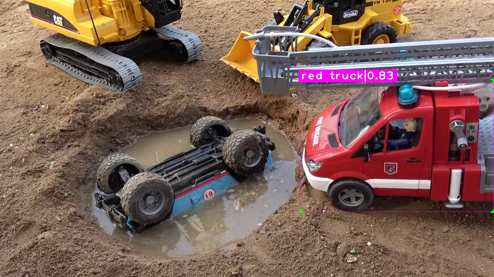
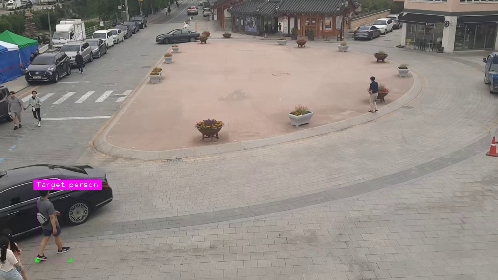
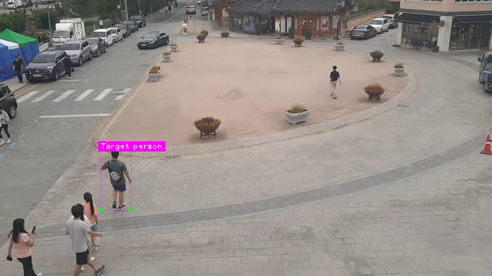

# Video Object Searching

## 1. Introduction
- **Overview**:
    - The script is in jupyter notebook "[Script_Task1.ipynb](./Script_Task1.ipynb)"
    - This task involves searching for a specified object shown in an input video and then saving the results as frames.
    - There are three different levels of finding object X:
        - Level 1: Find similar objects with no properties
        - Level 2: Find an object with the color property
        - Level 3: Recognizing a particular individual
    - Comprehensive information about the input data, along with a few demonstrations of output frames and solution concepts, is provided for each level.
    

    
    
    
 The structure of the output folders should be as follows 

    - Video 1
        - Object X
            - Frames
    - Video 2
        - Object X
            - Frames
    - Video 3
        - Object X
            - Frames
    </detais>
        
- **Accessing Results**:
    - Please visit [OneDrive folders](https://uithcm-my.sharepoint.com/:f:/g/personal/20521159_ms_uit_edu_vn/ErD0PyNokoBBpmdhy4l_8UEBfGlAg7kb56Na9ESFuKcHFw?e=hqgIsm) to access all the frames for each level of the video.
    - If you wish to download the frames, kindly visit [Google Drive folders](https://drive.google.com/drive/folders/1O9vLQIYHs27EWRpk_XKFqv87VzaoiQ38?usp=sharing) due to the efficient download system provided by Google Drive.
## 2. Input and Output

 Level 1: Find similar objects with no properties

#### Input
- Target object: A truck

    

- Searching video (This is a short version)

    
    

#### Output
- Video 1:

    

- Video 2:

    

Level 2: Find object with color property

#### Input
- Target object: A red truck

    

- Searching video (This is a short version)

    
    

#### Output
- Video 1:

    

- Video 2:

    

Level 3: Recognizing a particular individual

#### Input
- Target object

    

- Searching video (This is a short version)

    
#### Output

## 3. Solution

 Level 1: Find similar objects with no properties

- I utilized YOLO version 8 to identify trucks in each video frame.
- I employed cvzone to draw bounding boxes using coordinates generated by the YOLO model.

 Level 2: Find an object with color property

- I employed YOLO version 8 to identify trucks within each frame of the video.
- Subsequently, I generated a mask for each object using the model and used these masks to extract the object's pixel colors.
- Following this, I computed the ratio of pixels with the correct color (in this case, red) to the total number of pixels within the mask.
- If the ratio exceeded the manually set threshold, I utilized cvzone to plot a bounding box based on coordinates generated by the YOLO model.
- In cases where the ratio fell below the threshold, I omitted that particular object from further processing.

 Level 3: Recognizing a particular individual

- At this level, I utilized three neural networks to tackle two distinct sub-tasks.
- The first task involves detecting humans within the frame. To accomplish this, I employed YOLO version 8. Subsequently, I cropped the area encompassing potential objects based on the coordinates suggested by YOLO.
- The second task entails scoring the similarity between the target object (provided by the user) and potential objects. For this purpose, I employed the LoFTR model, as suggested in the paper "[Detector-Free Local Feature Matching with Transformers](https://zju3dv.github.io/loftr)".
    - This model identifies and extracts key points from the given image and the suggested area. It then establishes mappings between pairs of key points and provides confidence scores for these pairs.
    - Using the confidence scores of these pairs, I filtered out pairs with scores exceeding a specified threshold (I set it at 0.5, indicating higher model confidence). I counted the pairs meeting this criterion, using the count as a similarity score.
    - If the suggested object achieves a similarity score greater than the threshold (I recommend 85), I include this object in the tracking list.
- The third task involves object tracking.
    - If an object meets the similarity criterion, there is no need to recheck or recompute its similarity score before plotting a bounding box around it in the frame.
    - Conversely, if an object has been rejected a certain number of times, conserving computational resources becomes crucial.
    - Fortunately, YOLO version 8 supports object tracking. I retrieve the object's ID and keep a record of the number of times it has been rejected.

